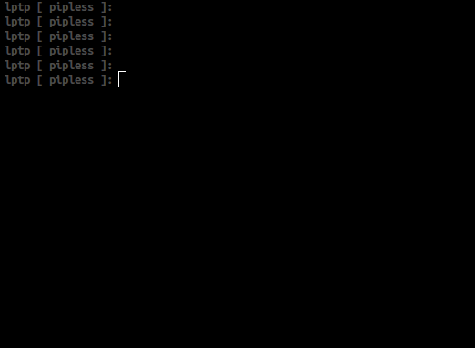
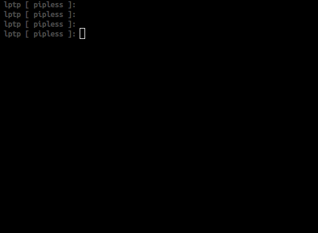

.. pipless documentation master file, created by
   sphinx-quickstart on Fri Sep  2 01:39:02 2016.
   You can adapt this file completely to your liking, but it should at least
   contain the root `toctree` directive.

pipless
===========

`pipless on github <https://github.com/d0c-s4vage/pipless>`_

.. code-block:: text

                   ░░┐            ▄▄▄       ▄▄▄▄▄▄▄▄▄   ▄▄▄▄▄▄▄▄▄   ▄▄▄▄▄▄▄▄▄ 
                  ░░┌┘           ▐░░░▌     ▐░░░░░░░░░▌ ▐░░░░░░░░░▌ ▐░░░░░░░░░▌
                 ░░┌┘            ▐░░░▌     ▐░░░▛▀▀▀▀▀  ▐░░░▛▀▀▀▀▀  ▐░░░▛▀▀▀▀▀ 
     +━━+        └─┘ +━━+        ▐░░░▌     ▐░░░▌       ▐░░░▌       ▐░░░▌      
     ┃╳╳━━━━━━━+ +━+ ┃╳╳━━━━━━━+ ▐░░░▌     ▐░░░▙▄▄▄▄▄  ▐░░░▙▄▄▄▄▄  ▐░░░▙▄▄▄▄▄ 
     ┃╳╳┃      ┃ ┃╳┃ ┃╳╳┃      ┃ ▐░░░▌     ▐░░░░░░░░░▌ ▐░░░░░░░░░▌ ▐░░░░░░░░░▌
     ┃╳╳┃      ┃ ┃╳┃ ┃╳╳┃      ┃ ▐░░░▌     ▐░░░▛▀▀▀▀▀   ▀▀▀▀▀▜░░░▌  ▀▀▀▀▀▜░░░▌
     ┃╳╳━━━━━━━+ +━+ ┃╳╳━━━━━━━+ ▐░░░▌     ▐░░░▌             ▐░░░▌       ▐░░░▌
     ┃╳╳┃            ┃╳╳┃        ▟░░░▙▄▄▄▄▄▟░░░▙▄▄▄▄▄▄▄▄▄▄▄▄▄▟░░░▙▄▄▄▄▄▄▄▟░░░▌
     ┃╳╳┃            ┃╳╳┃       ▐░░░░░░░░░░░░░░░░░░░░░░░░░░░░░░░░░░░░░░░░░░░░▌
     +━━+            +━━+        ▀▀▀▀▀▀▀▀▀▀▀▀▀▀▀▀▀▀▀▀▀▀▀▀▀▀▀▀▀▀▀▀▀▀▀▀▀▀▀▀▀▀▀▀ 

By James `@d0c_s4vage <https://twitter.com/d0c_s4vage>`_ Johnson

Intro
-----

``pipless`` (pip LESS, as in "use it less frequently") automagically creates and activates
virtual environments, installs packages dynamically, and keeps your project's
``requirements.txt`` up-to-date by (re)generating it when the process exits.

No more must python developers go through the rote project lifecycle steps of

* Creating a virtual environment
* Activating it
* Manually updating the requirements.txt when it's realized that additional packages are needed
* Not forgetting to run ``pip freeze`` to pin your requirements to specific versions!

Not only does it perform all the above steps for you, it does it *WITHOUT REQUIRING
ANY CODE CHANGES*

Use Cases
---------

In most situations ``pipless`` can be used as a drop-in replacement for directly
using the python executable.

It can be used in three ways:

1. To run a separate python script:

2. To start an interactive python shell:

3. Directly imported and initialized in Python:

.. code-block:: python

    import pipless
    pipless.init(... opts ...)

    import tabulate

Installation
------------

Normal Install
^^^^^^^^^^^^^^

``pipless`` is not currently on PyPI. However, it can be directly installed from github
with the command below:

.. code-block:: bash

   pip install --upgrade git+git://github.com/d0c-s4vage/pipless.git

Virtual Environment Install
^^^^^^^^^^^^^^^^^^^^^^^^^^^

``pipless`` itself can even be installed inside of a virtual environment:

.. code-block:: bash

   virtualenv pipless_venv
   source pipless_venv/bin/activate
   pip install --upgrade git+git://github.com/d0c-s4vage/pipless.git

Source Code "Install"
^^^^^^^^^^^^^^^^^^^^^

If you'd prefer to try ``pipless`` out without actually installing it, you can do
something similar to the commands below:

.. code-block:: bash

    cd /tmp
    git clone https://github.com/d0c-s4vage/pipless.git
    cd pipless
    git checkout develop
    PATH="/tmp/pipless/scripts:$PATH"
    PYTHONPATH="/tmp/pipless:$PYTHONPATH"
    pipless --help

.. toctree::
   :maxdepth: 2

   pipless

Indices and tables
==================

* :ref:`genindex`
* :ref:`modindex`
* :ref:`search`

